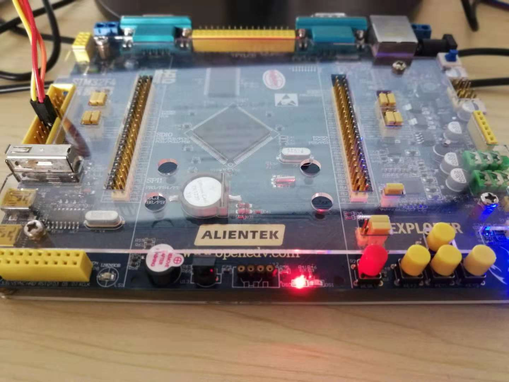

# 第 1 节：利用 PIN 设备控制 LED

## 基础知识

为了给用户提供操作 GPIO 的通用 API，方便应用程序开发，RT-Thread 中引入了通用 GPIO设备驱动。并提供类似 Arduino 风格的 API 用于操作 GPIO，如设置 GPIO 模式和输出电平、读取 GPIO 输入电平、配置 GPIO 外部中断等。

常用的 PIN 设备的 API 有以下几个：

| API               | 描述                       |
| ----------------- | -------------------------- |
| rt_pin_mode       | 设置 GPIO 模式             |
| rt_pin_write      | 输出电平                   |
| rt_pin_read       | 读取 GPIO 输入电平         |
| rt_pin_attach_irq | 挂载 GPIO 外部中断回调函数 |
| rt_pin_detach_irq | 脱离 GPIO 外部中断回调函数 |
| rt_pin_irq_enable | 配置 GPIO 外部中断开关     |

如果只是控制 LED 的亮灭只需要使用 `rt_pin_mode/write/read` 这三个函数即可。

- 使用 rt_pin_mode 函数将驱动 LED 的 IO 口初始化为推挽输出模式，
- 使用 rt_pin_write 函数来控制 IO 口的电平高低，
- 使用 rt_pin_read 函数来读取 IO 口的电平高低。

## 硬件连接

本教程使用 正点原子 STM32F4 探索者 作为演示平台， 在开发板上有一个红色的 LED 灯，我们使用这颗 LED 作为播放器的状态指示灯，硬件的连接如下图所示，其对应的 PIN 脚为 21：

> 注意：一般情况下如果芯片的选择正确的话，这里的 PIN 的编号 21 和芯片上对应的 PIN 脚是一样的。但是有时可能会不一样，需要去 drv_pin/drv_gpio.c 里检查一下，GPIOF9 对应的 PIN 编号是不是 21。


下面详细介绍一下软件的实现。

## 软件实现

LED 模块是最简单的一个模块，它只需要有几个API 即可，像初始化、开/关、翻转即可。

```{.c}
int led_init(void);          //LED 灯初始化
int led_on(void);            //LED 灯亮
int led_off(void);           //LED 灯灭
int led_toggle(void);        //LED 灯亮灭状态翻转
```

然后就只要使用这几个 API 就可以控制 LED 的全部行为。

我们新建一个 `led.h` 的文件，将上面的这些函数声明放到  `led.h` 文件里，方便其他文件的调用。

为了防止头文件被重复包含，一般需要在文件的头部添加宏的判断，如下所示：

```
#ifndef LED_H
#define LED_H
...头文件的具体内容...
#endif
```

然后再新建一个 `led.c` 文件，在文件里添加下面的头文件

```
#include <rtdevice.h>  //使用 RT-Thread pin 设备需要包含此头文件
#include "led.h"       //对应的头文件
```

为了程序更好的可移植性，把 LED 使用的管脚用宏定义的方式来表示，如下所示：

```
#define LED_PIN     21
```

然后在文件 `led.c` 里分别实现上面的几个 API。

### LED 初始化

```{.c}
int led_init(void);          //LED 灯初始化
```

在 LED 初始化函数里，需要完成 PIN 设备的配置，将 PIN 设备设定成输出模式。代码如下所示：

```{.c}
int led_init(void)
{
    /* 设定 LED 引脚为推挽输出模式 */
    rt_pin_mode(LED_PIN, PIN_MODE_OUTPUT);
    return 0;
}
```

### LED 亮

```{.c}
int led_on(void);            //LED 灯亮
```

假设 LED 低电平亮，调用 API 输出低电平，驱动 LED。

```{.c}
int led_on(void)
{
    /* 调用 API 输出低电平 */
    rt_pin_write(LED_PIN, PIN_LOW);
    return 0;
}
```

### LED 灭

```{.c}
int led_off(void);            //LED 灯灭
```

假设 LED 高电平灭，调用 API 输出低电平，使 LED 熄灭。

```{.c}
int led_off(void)
{
    /* 调用 API 输出高电平 */
    rt_pin_write(LED_PIN, PIN_HIGH);
    return 0;
}
```

### LED 状态翻转

```{.c}
int led_toggle(void);        //LED 灯亮灭状态翻转
```

要使 LED 状态翻转应先利用API  `rt_pin_read` 读出当前电平，然后输出相反电平 

```{.c}
int led_toggle(void)
{
    /* 调用 API 读出当前电平 然后输出相反电平 */
    rt_pin_write(LED_PIN, !rt_pin_read(LED_PIN));
    return 0;
}
```

## 示例程序

这样就可以在 `main.c` 里包含 `led.h` 头文件，然后使用这些 API 来控制 LED 灯的亮灭了。

下面是一段控制 LED 灯每隔 500 ms 闪烁一次的函数，运行的结果如下图所示。

```{.c}
#include <rtthread.h>
#include "led.h"

int main(void)
{
    /* user app entry */
    led_init();
    led_on();
    while (1)
    {
        led_toggle();
        rt_thread_mdelay(500);
    }
}
```

