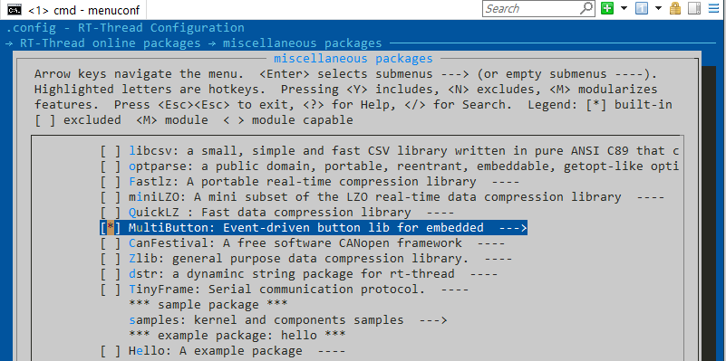
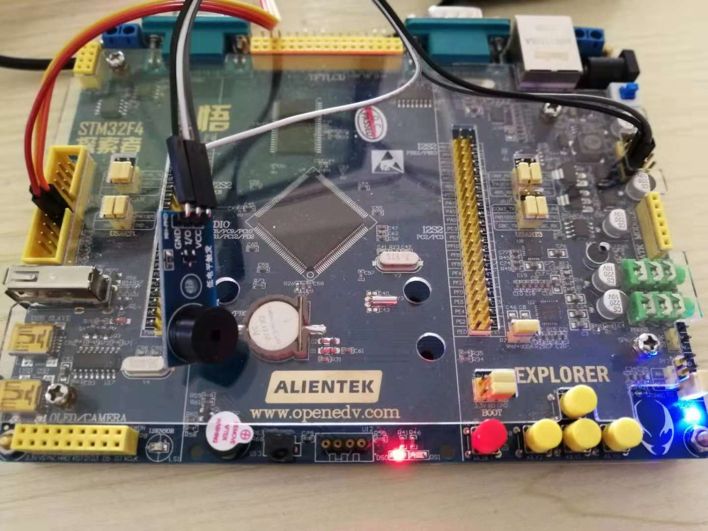

# 第 5 节：使用 MultiButton 软件包进行按键控制

上一节的示例程序，演示了播放器内核的基础使用，但是只能循环播放，不能控制的播放器叫什么播放器。因此，这一节我们使用 MultiButton 软件包驱动按键，并实现按键控制播放器的行为：上一曲、下一曲、暂停/播放，音量调节。

## 基础知识

### 软件包介绍

在 RT-Thread 的在线软件包中有一个按键驱动软件包 MultiButton，它是由 liu2guang 移植到 RTT 在线软件包中的。MultiButton 是一个小巧简单易用的事件驱动型按键驱动模块，支持按键事件的回调异步处理方式，可以简化程序结构，去除冗余的按键处理硬编码，让按键业务逻辑更清晰。支持的按键事件如下所示。

| 事件             | 说明                                 |
| ---------------- | ------------------------------------ |
| PRESS_DOWN       | 按键按下，每次按下都触发             |
| PRESS_UP         | 按键弹起，每次松开都触发             |
| PRESS_REPEAT     | 重复按下触发，变量repeat计数连击次数 |
| SINGLE_CLICK     | 单击按键事件                         |
| DOUBLE_CLICK     | 双击按键事件                         |
| LONG_RRESS_START | 达到长按时间阈值时触发一次           |
| LONG_PRESS_HOLD  | 长按期间一直触发                     |

### 使用方法

1.先申请一个按键结构

```
struct Button button1;
```

2.初始化按键对象，绑定按键的GPIO电平读取接口**read_button_pin()** ，后一个参数设置有效触发电平

```{.c}
button_init(&button1, read_button_pin, 0);
```

3.注册按键事件

```{.c}
button_attach(&button1, SINGLE_CLICK, Callback_SINGLE_CLICK_Handler);
button_attach(&button1, DOUBLE_CLICK, Callback_DOUBLE_Click_Handler);
...
```

4.启动按键

```{.c}
button_start(&button1);
```

5.设置一个5ms间隔的定时器循环调用后台处理函数

```{.c}
while(1) {
    ...
        button_ticks();
    }
}
```

### 获取方式

利用 env 工具可以很方便的获取到这个软件包。在我们的 BSP 相应开发板目录下，右键打开 env 工具，输入 `menuconfig` 配置工程。根据路径 `RT-Thread online packages → miscellaneous packages` 找到 `MultiButton` 软件包。



按上下键移动光标选中软件包之后，按空格键开启软件包，然后回车配置软件包的参数，版本选择最新版。

保存并退出 env，然后，使用命令 `pkgs --update` 或通过`自动更新pkg功能`更新软件包。然后，使用更新工程命令 `scons --target=mdk5 -s` 即可将软件包源码添加到工程项目里。

## 硬件连接

以正点原子探索者 STM32F4 开发板为例。开发板上有四个供用户使用的按键 KEY_UP/KEY0/1/2，通过原理图可以看出，KEY0/1/2 三个按键对应的 PIN 分别是 1/2/3。


## 软件实现

要做一个音乐播放器，需要有什么按键的功能呢？暂停/播放，上一曲，下一曲，音量加/减。要实现这几个按键的功能，需要借助 MultiButton 软件包的单击事件和长按事件。

根据按键在开发板上的排布，我们使用左边的 KEY2 作为`上一曲`的按键，长按为`音量减`；右边的按键 KEY0 作为`下一曲`的按键，长按为`音量加`；中间的按键 KEY1 作为 `暂停/播放` 的按钮。

为了使按键处理的代码更清晰，使用按键回调的方式处理按键事件，当有按键事件发生时，直接调用对应的事件回调函数处理。这样所有的业务代码都将在模块内部实现，只需要一个初始化函数供外部调用即可。

```{.c}
int key_init(void);                     //按键初始化
```

同样我们新建一个 `key.h` 的文件，将按键初始化函数声明放到  `key.h` 文件里，方便其他文件的调用。

然后再新建一个 `key.c` 文件，在文件里添加下面的头文件

```{.c}
#include <rtthread.h>  //RT-Thread 标准头文件
#include <rtdevice.h>  //使用 RT-Thread 的设备需要包含此头文件
#include "key.h"
```

为了程序更好的可移植性，把 key 使用的 PIN 设备用宏定义的方式来表示，如下所示：

```{.c}
#define KEY_PLAY_PIN     2
#define KEY_LAST_PIN     1
#define KEY_NEXT_PIN     3
#define KEY_PRESS_LEVEL  0
```

先为三个按键申请三个按键结构体

```{.c}
static struct button btn_last, btn_next, btn_play;
```

然后分别实现这三个键值的读取函数

### 读键值的实现

使用 pin 设备的操作接口进行键值的读取，实现代码如下所示：

```{.c}
static uint8_t btn_last_read(void)
{
    return rt_pin_read(KEY_LAST_PIN);
}
static uint8_t btn_next_read(void)
{
    return rt_pin_read(KEY_NEXT_PIN);
}
static uint8_t btn_play_read(void)
{
    return rt_pin_read(KEY_PLAY_PIN);
}
```

然后需要写这三个函数的按键事件回调函数。

### 上一曲按键回调

在上一曲按键回调函数里需要判断按键事件，并根据不同的按键事件做不同的处理，短按切换为上一曲，长按减小音量。由于使用的 player 结构体定义在 mian.c 里，因此我们要定义一个外部变量，`extern struct player player;` 然后才能使用 player 的 API 控制播放器的行为。实现代码如下：

```{.c}
extern struct player player;

static void btn_last_cb(void *btn)
{
    uint32_t btn_event_val;
    uint8_t volume;

    btn_event_val = get_button_event((struct button *)btn);

    switch (btn_event_val)
    {
    case SINGLE_CLICK:
        player_control(&player, PLAYER_CMD_LAST, RT_NULL);

        /*打印一次播放状态*/
        player_show(&player);
        break;
    case LONG_PRESS_HOLD:
        player_control(&player, PLAYER_CMD_GET_VOL, &volume);
        if (volume > 1)
        {
            volume--;
            player_control(&player, PLAYER_CMD_SET_VOL, &volume);
        }
        break;
    }
}
```

### 下一曲按键回调

在下一曲按键回调函数里需要做的事情和上一曲相似， 只是上一曲换成了下一曲，长按减小音量变为了增大音量。

```{.c}
static void btn_next_cb(void *btn)
{
    uint32_t btn_event_val;
    uint8_t volume;

    btn_event_val = get_button_event((struct button *)btn);

    switch (btn_event_val)
    {
    case SINGLE_CLICK:
        player_control(&player, PLAYER_CMD_NEXT, RT_NULL);

        /*打印一次播放状态*/
        player_show(&player);
        break;
    case LONG_PRESS_HOLD:
        player_control(&player, PLAYER_CMD_GET_VOL, &volume);
        if (volume < 99)
        {
            volume++;
            player_control(&player, PLAYER_CMD_SET_VOL, &volume);
        }
        break;
    }
}
```

### 播放/暂停按键回调

在暂停/播放按键的回调函数里，只需要处理单击事件即可，检测播放器当前状态，如果当前状态时播放状态就改为停止状态，如果时停止状态，就改为播放状态。

```{.c}
static void btn_play_cb(void *btn)
{
    uint32_t btn_event_val;

    btn_event_val = get_button_event((struct button *)btn);

    switch (btn_event_val)
    {
    case SINGLE_CLICK:
        /* 根据当前播放状态切换播放状态 */
        if (player.status == PLAYER_RUNNING)
        {
            player_control(&player, PLAYER_CMD_STOP, RT_NULL);
        }
        else
        {
            player_control(&player, PLAYER_CMD_PLAY, RT_NULL);
        }

        /*打印一次播放状态*/
        player_show(&player);
        break;
    }
}
```

写完回调函数函数之后就要进行按键的初始化和绑定回调事件了。

### 初始化按键

我们在初始化函数里进行按键的硬件初始化，然后调用 MultiButton 软件包的 API 初始化按键结构体，并注册按键的回调函数，并启动按键。

启动完按键之后还需要周期性调用按键扫描的函数，这里时通过创建了一个定时器的形式，进行循环调用的。

注意：此处我们默认KEY_LAST_PIN和KEY_NEXT_PIN连接的按键是对GND的，所以配置为PIN_MODE_INPUT_PULLUP（上拉输入）；默认KEY_PLAY_PIN
连接的按键是对3.3V的，所以配置为PIN_MODE_INPUT_PULLDOWN（下拉输入）。具体使用哪种输入方式需要根据按键的连接方式而定。

```{.c}
static void btn_scan(void *p)
{
    button_ticks();
}
int key_init(void)
{
    rt_timer_t timer = RT_NULL;

    /* last key init */
    rt_pin_mode(KEY_LAST_PIN, PIN_MODE_INPUT_PULLUP);
    button_init(&btn_last, btn_last_read, PIN_LOW);
    button_attach(&btn_last, SINGLE_CLICK,     btn_last_cb);
    button_attach(&btn_last, LONG_PRESS_HOLD,  btn_last_cb);
    button_start(&btn_last);

    /* next key init */
    rt_pin_mode(KEY_NEXT_PIN, PIN_MODE_INPUT_PULLUP);
    button_init(&btn_next, btn_next_read, PIN_LOW);
    button_attach(&btn_next, SINGLE_CLICK,     btn_next_cb);
    button_attach(&btn_next, LONG_PRESS_HOLD,  btn_next_cb);
    button_start(&btn_next);

    /* play key init */
    rt_pin_mode(KEY_PLAY_PIN, PIN_MODE_INPUT_PULLDOWN);
    button_init(&btn_play, btn_play_read, PIN_LOW);
    button_attach(&btn_play, SINGLE_CLICK,     btn_play_cb);
    button_start(&btn_play);
    
    /* 创建定时器1 */
    timer = rt_timer_create("timer1", /* 定时器名字是 timer1 */
                             btn_scan, /* 超时时回调的处理函数 */
                             RT_NULL, /* 超时函数的入口参数 */
                             RT_TICK_PER_SECOND * TICKS_INTERVAL / 1000, /* 定时长度，以OS Tick为单位，即10个OS Tick */
                             RT_TIMER_FLAG_PERIODIC | RT_TIMER_FLAG_SOFT_TIMER); /* 周期性定时器 */
    /* 启动定时器 */
    if (timer != RT_NULL)
        rt_timer_start(timer);

    return RT_EOK;
}
```

## 示例程序

 这一节的示例程序和上一节的基本一样，只是加一个 `key.h` 的头文件，并在main 函数里调用一下按键的初始化函数即可。为了实现一个完整的播放器，我们再为这个播放器添加上一个状态指示灯。目的是在播放器播放时，灯会一直闪烁；暂停播放时，灯就熄灭了。要完成这个功能，就需要改变一下音频设备的接口，将led 看作音频设备的一部分，音频设备开的时候，led 也打开 ，音频设备关的时候 led 也关闭 ，音频设备在播放的时候，led 开始闪烁等。示例代码如下：

```{.c}
#include <rtthread.h>

#include "player.h"
#include "song_data.h"
#include "beep.h"
#include "decode.h"
#include "key.h"
#include "led.h"

struct player player;
struct audio_ops audio;
struct decode_ops decode;

uint8_t beep_volume = 3;

/* 解码器的读操作接口 */
int decode_read(void *song, int index, void *buffer, int size)
{
    beep_song_get_data(song, index, buffer);
    /* 返回歌曲进度的增量 */
    return 1;
}
/* 解码器的控制操作接口 */
int decode_control(void *song, int cmd, void *arg)
{
    if (cmd == DECODE_OPS_CMD_GET_NAME)
        beep_song_get_name(song, arg);
    else if (cmd == DECODE_OPS_CMD_GET_LEN)
        *(uint16_t *)arg = beep_song_get_len(song);
    return 0;
}
int audio_init(void)
{
    beep_init();
    led_init();
    return 0;
}
int audio_open(void)
{
    beep_on();
    led_on();
    return 0;
}
int audio_close(void)
{
    beep_off();
    led_off();
    return 0;
}
int audio_control(int cmd, void *arg)
{
    if (cmd == AUDIO_OPS_CMD_SET_VOL)
        beep_volume = *(uint8_t *)arg;
    return beep_volume;
}
int audio_write(void *buffer, int size)
{
    struct beep_song_data *data = buffer;

    led_toggle();

    beep_on();
    beep_set(data->freq, beep_volume);
    rt_thread_mdelay(data->sound_len);
    beep_off();
    rt_thread_mdelay(data->nosound_len);

    return size;
}
int player_init(void)
{
    decode.init = beep_song_decode_init;
    decode.control = decode_control;
    decode.read = decode_read;

    audio.init = audio_init;
    audio.open = audio_open;
    audio.close = audio_close;
    audio.control = audio_control;
    audio.write = audio_write;

    player.decode = &decode;
    player.audio = &audio;

    player_add_song(&player, (void *)&song1);
    player_add_song(&player, (void *)&song2);
    player_add_song(&player, (void *)&song3);
    player_add_song(&player, (void *)&song4);
    player_start(&player);

    player_control(&player, PLAYER_CMD_PLAY, RT_NULL);
    player_show(&player);

    return 0;
}
int main(void)
{
    /* user app entry */
    player_init();
    key_init();
    return 0;
}
```



## 程序源码

key.c/.h:<https://github.com/Guozhanxin/RTT-BeepPlayer/tree/master/code/key>

示例程序:<https://github.com/Guozhanxin/RTT-BeepPlayer/blob/master/samples/main_5.c>